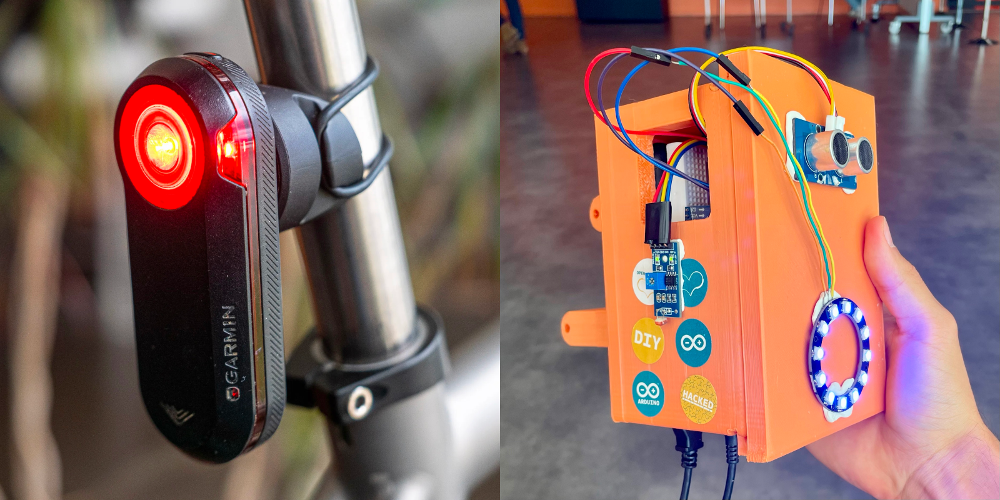
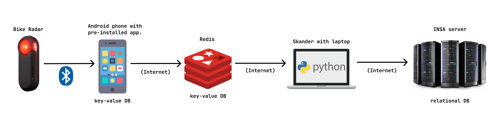
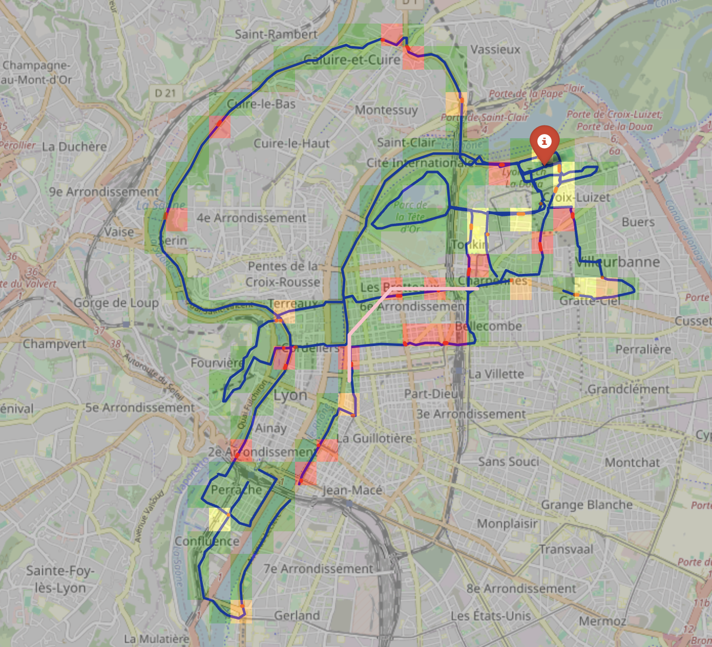

# Bike-Radar
This team project was completed as part of studies during 2nd year. This repository contains solely my contributions to the project.

The goal of this project was to create a device similar to the Garmin Varia, designed to detect approaching cars from behind cyclists and alert the user. Our device includes some other features: crash detection and automatic adjustment of the rear light based on ambient light conditions. The device is controlled by an Arduino, which is connected to several sensors: an ultrasonic distance sensor, a gyroscope, a luminosity sensor, and a Bluetooth module. It sends information to a custom mobile app via Bluetooth (the app is not included in this repository). The app interacts with a cloud-based key-value storage Redis. All collected data is subsequently transferred to a relational database hosted on the institute's server (as required by the course). For data analysis, a script was developed to generate a map indicating danger levels for cyclists and to suggest fast and safe routes.

# Gallery
### _Garmin Varia / Bike Radar_

### _Data transmission scheme_

### _Map with danger levels_

